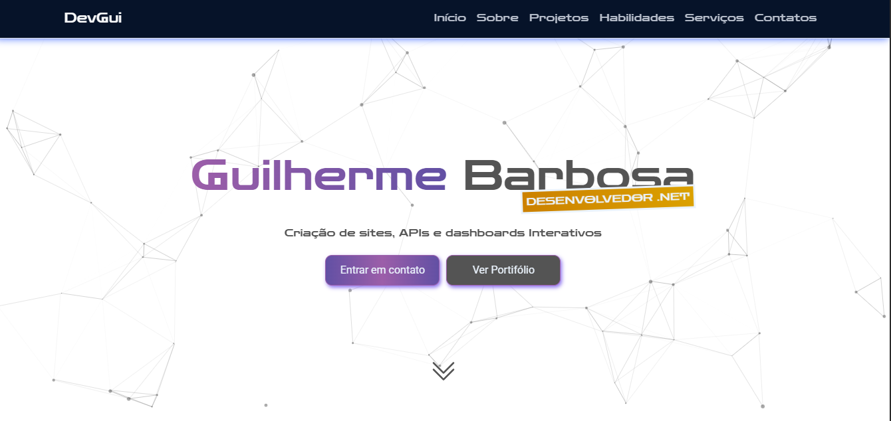
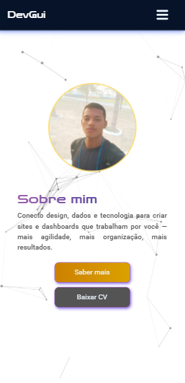
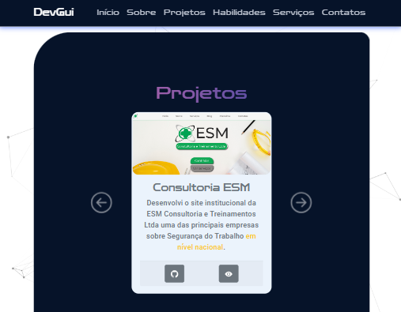

# 💼 Portfólio Pessoal - Guilherme Barbosa

Site institucional desenvolvido para apresentar meus projetos, tecnologias, serviços, contatos e experiência como Desenvolvedor Full-Stack.



---

## 🔗 [Acesse o site aqui](https://devguilherme.azurewebsites.net)

---

## 📑 Sumário

- [🎨 Identidade Visual](#-identidade-visual)
- [🛠️ Tecnologias Utilizadas](#️-tecnologias-utilizadas)
- [📦 Estrutura do Projeto](#-estrutura-do-projeto)
- [📌 Funcionalidades](#-funcionalidades)
- [📲 Responsividade](#-responsividade)
- [📸 Screenshots](#-screenshots)
- [📥 Instalação Local](#-instalação-local)
- [📧 Contatos](#-contatos)

---

## 🎨 Identidade Visual

- Estilo: **Moderno**, **minimalista**, **criativo**, **sofisticado**
- Paleta de cores: Branco, Roxo, Preto, Cinza e Amarelo discreto
- Foco: Clareza, contrastes sutil e design minimalista

---

## 🛠️ Tecnologias Utilizadas

- HTML5 e CSS3
- ASP.NET Core Web App (Razor Pages)
- **Libs:** Boostrap, Google Fonts, Particles.js, AOS

---

## 📦 Estrutura do Projeto

O site é dividido em seções claras e objetivas:

- **Início** – Apresentação direta com destaque visual  
- **Sobre mim** – Breve descrição profissional  
- **Projetos** – Portfólio com links e descrições  
- **Habilidades** – Tecnologias dominadas
- **Serviços** – Tipos de soluções que ofereço em geral  
- **Contatos** – Meios para entrar em contato

---

## 📌 Funcionalidades

- Layout institucional moderno
- Design 100% responsivo
- Link para download do meu currículo
- Animações suaves com Animation.css
- Navegação fluida com âncoras
- Links para projetos reais e pessoais
- Integração com redes sociais

---

## 📲 Responsividade

O site se adapta perfeitamente a diferentes tamanhos de tela:

- 💻 Desktop  
- 📱 Mobile  
- 📟 Tablet  

---

## 📸 Screenshots

<div align="center">
    
    
    
</div>

---

## 📥 Instalação Local

```bash
git clone https://github.com/devguilherme-b/Portifolio.git
cd Portifolio
dotnet restore
dotnet run
```
Acesse no navegador:

```
http://localhost:5000
```

## 📧 Contatos

Caso tenha dúvidas, sugestões ou queira se conectar, entre em contato através das redes abaixo:

- 📧 Email: [dev.guilhermebarbos@gmail.com](mailto:dev.guilhermebarbos@gmail.com)
- 📸 Instagram: [@dev.guilhermee](https://www.instagram.com/dev.guilhermee)
- 💼 LinkedIn: [Guilherme Barbosa](https://www.linkedin.com/in/devguilhermebarbosa/)